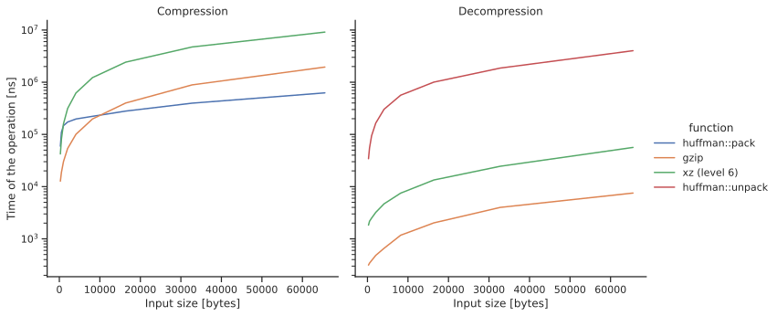
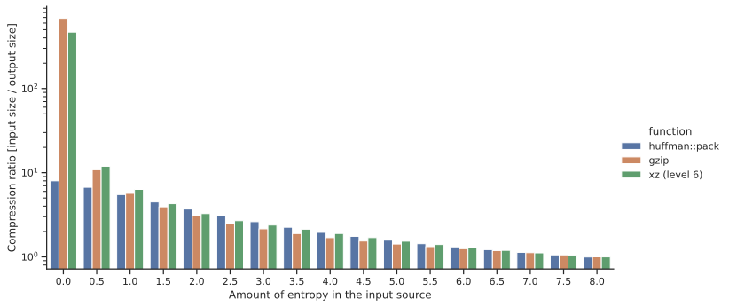

# Huffman format

An experimental, non production ready custom file format based on huffman coding. This is a project I've made mostly to learn more about how to implement that coding and implement binary trees.

Here is the other important things I've learned while making this project :

- How to use criterion to do benchmarking and custom benchmarking, and how to load and analyze its data using seaborn and pandas
- How to do fuzzing, and use fuzzing in some unorthodox ways
- How to implement pipes between programs
- How to use coverage tools

## Project structure

- The crate at the root of the project contains the huffman format library
- `bitpack` contains all the code related to bit reading and writing
- `benchmarks` contains all the benchmarking related code. It's in a separate crate because the performance of that library is compared to some used other library as well
- `benchmarks/analysis` contains the python code responsible from loading the criterion generated csv files and generating the charts from them
- `fuzz` contains the all the fuzz targets.
- `cli` contains a command line program which use that library

## Important 

Like i sead, that's more an experimentation that a library meant to be used in production. Here is why I'm saying this :

- Even though i've learned how to use criterion, that library is not optimized, you can check the charts below to see the comparison with some other used libraries, especially for the decompression.
- Even though i've learned how to use coverage tools, some parts of that library are not tested very well using unit testing, or not tested at all. That's because either I know they works, or I've tested them but in other ways. For example, to ensure the data is intact after a compression and a decompression, I don't use unit testing, but fuzzing, as fuzzing tools is very good at generating random data.
- There are no documentation on the public function of that library

On top of that, this format has several limitations :
- The input source can't be streamed when compressing data, as it requires one pass to count the amount of each bytes in a source and then another pass to compress that source
- The compression of folders are not supported, only individual files
- No encryption, no integrity checks, only the bare minimum infos

## Performance

# License

This is the public domain, as described on the <https://unlicense.org>.
